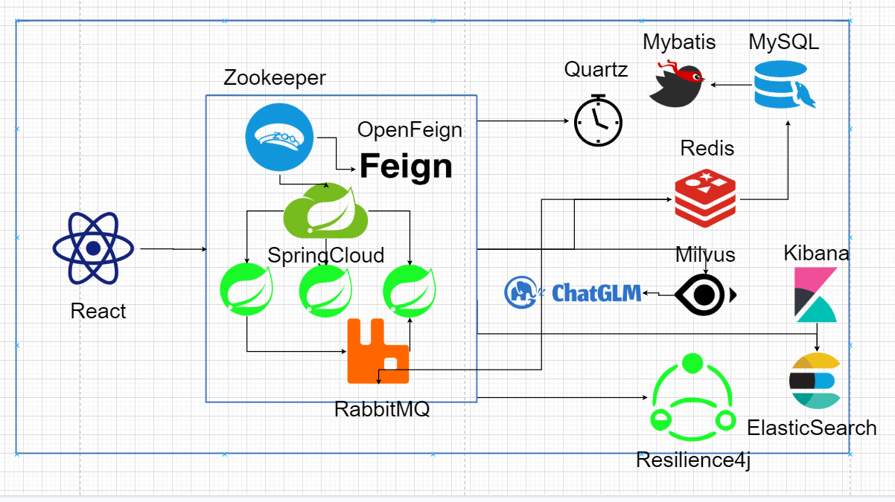
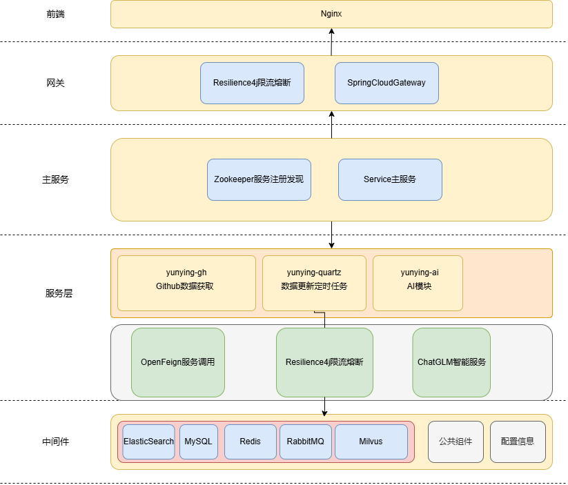

# YunYing（云影）

- 架构图



- 如何运行

1. 克隆代码
2. 安装对应的服务

Zookeeper

```
docker run -d --name zookeeper -p 2181:2181 -p 2888:2888 -p 3888:3888 zookeeper
```

ElasticSearch

```
docker run -d --name es --network yunying -e "ES_JAVA_OPTS=-Xms512m -Xmx512m" -e "discovery.type=single-node" -v es-data:/usr/share/elasticsearch/data -v es-plugins:/usr/share/elasticsearch/plugins --privileged -p 9200:9200 -p 9300:9300 elasticsearch:latest
```

Kibana

```
docker exec -it es ./bin/elasticsearch-plugin  install https://github.com/medcl/elasticsearch-analysis-ik/releases/download/v7.12.1/elasticsearch-analysis-ik-7.12.1.zip
```

RabbitMQ

```
docker run -e RABBITMQ_DEFAULT_USER=root -e RABBITMQ_DEFAULT_PASS=20040217 -v mq-plugins:/plugins --name mq --hostname mq -p 15672:15672 -p 5672:5672 --network yunying -d rabbitmq:latest
```

MySQL

```
 docker run -p 3306:3306 --name mysql -e MYSQL_ROOT_PASSWORD=root -d mysql
```

Milvus

```
curl -sfL https://raw.githubusercontent.com/milvus-io/milvus/master/scripts/standalone_embed.sh -o standalone_embed.sh

bash standalone_embed.sh start
```

Redis

```
docker run --name redis -d -p 6379:6379 redis
```

3. 将application-dev.yml里面的改为自己的配置，github的token需要改成自己的

4. 运行各个服务

## 前端架构


## 后端架构


